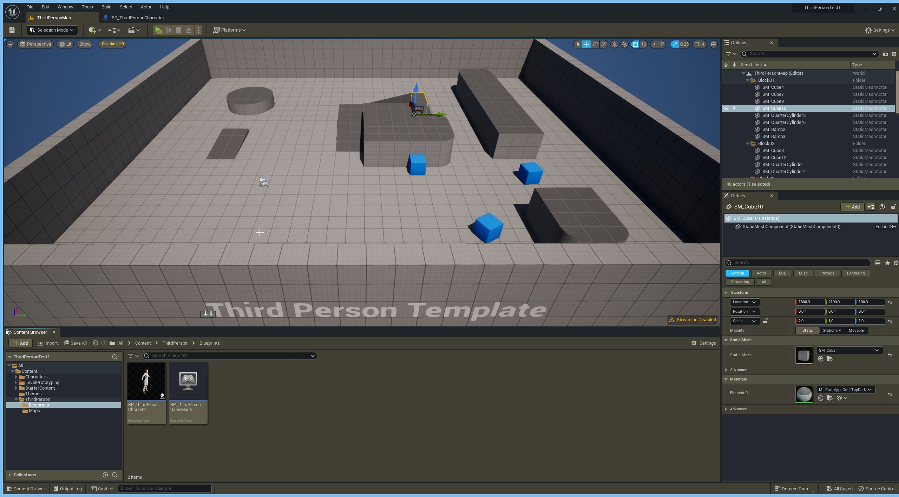
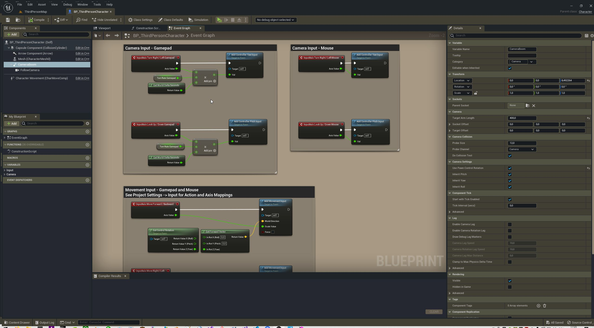
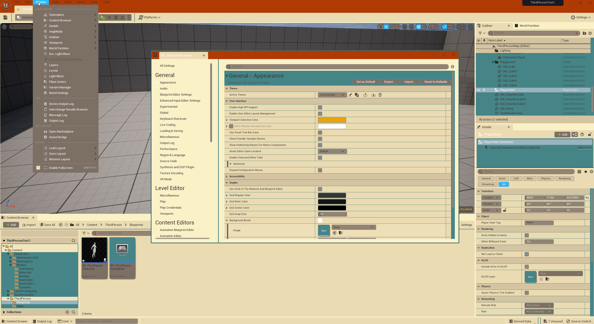
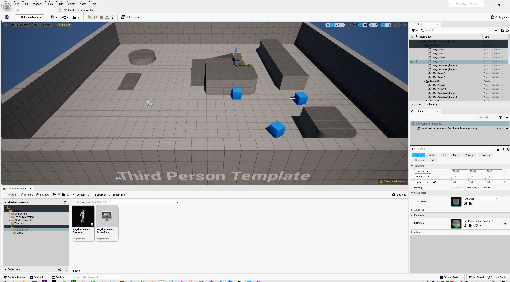

# Some Unreal Engine 5 Themes so the UI has less depressing colors 🍭

## Military

## Retro Gruvbox Light

## Light

## Changing Graphs Background
If you want to adjust the Blueprint Graphs background:
1. Import the images in Designs/*.png into your project.
2. Go to Editor Preferences/Appearance/Graphs/Background Brush.
3. Choose image from step 1.

